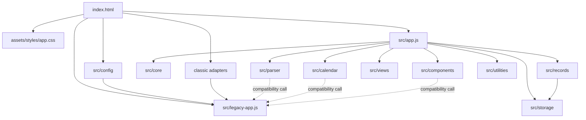

# Shike v1.1.0 Module Dependency Graph

All ES imports originate at `src/app.js` and resolve to local relative paths. The graph test found no unresolved imports and no cycles. Compatibility calls are runtime bridges, not ES imports, so legacy code cannot import back into the module graph.
