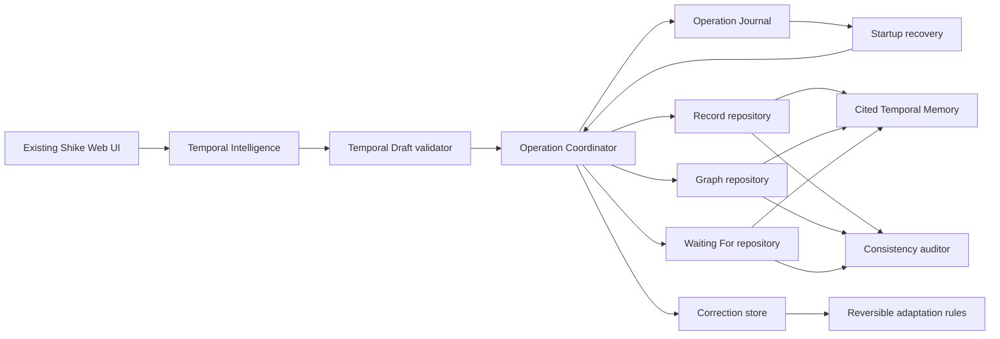

# Architecture

All durable stores are local IndexedDB. BroadcastChannel carries invalidation hints; correctness depends on IndexedDB locks, optimistic resource versions, operation IDs, and journal replay.
