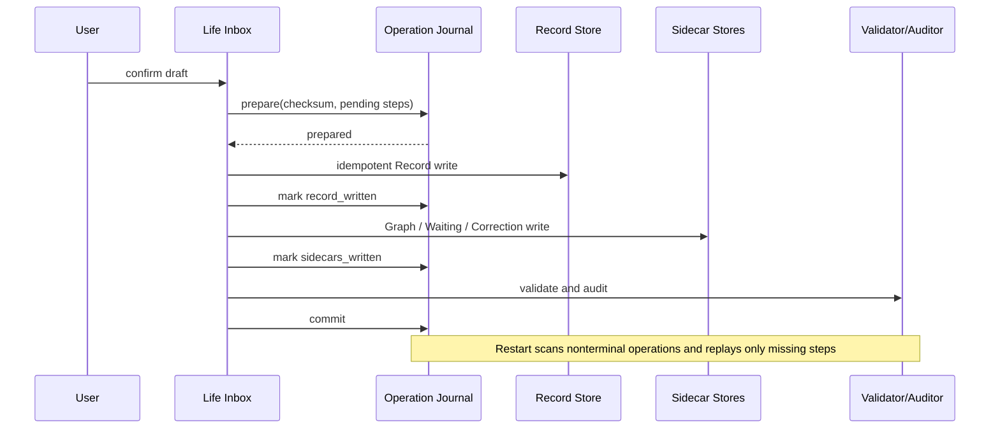

# Data Flow

Full operation payloads are not stored in the journal. Operations that require replay parameters use an independent local staging item keyed by operation ID; it is deleted after commit. A crash before staging leaves a no-op operation that is quarantined rather than guessed.
